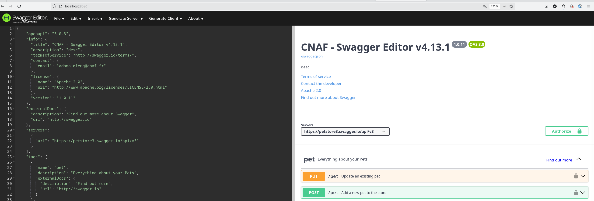
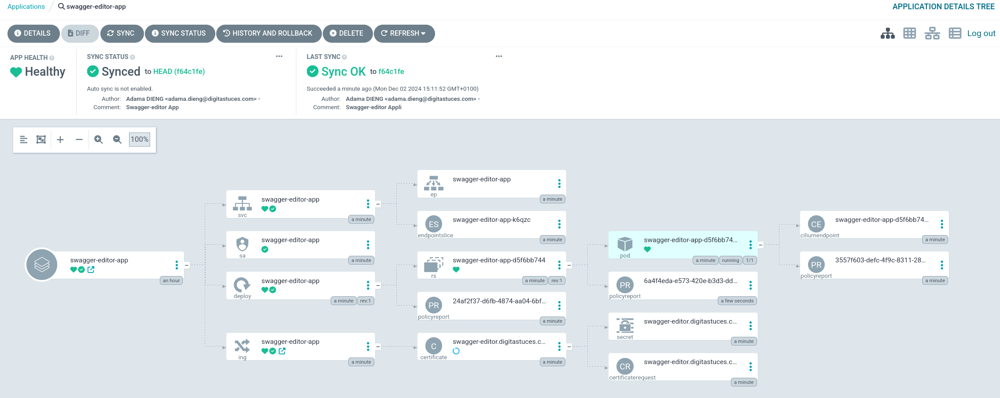

# Swagger Editor

- Pre-requis:


Technology | Version
---------- | -------
Swagger UI | v4.13.1
Docker     | x
Helm       | x

## Structure du projet :

```sh
swagger-editor/
├── apps
│   └── swagger-editor-app.yaml
├── docker-compose.yml
├── Dockerfile
├── helmfile.yaml
├── README.md
├── resources
│   ├── api
│   │   └── swagger.json
│   └── examples
└── swagger-editor
    ├── charts
    ├── Chart.yaml
    ├── README.md
    ├── templates
    │   ├── deployment.yaml
    │   ├── _helpers.tpl
    │   ├── hpa.yaml
    │   ├── ingress.yaml
    │   ├── NOTES.txt
    │   ├── serviceaccount.yaml
    │   ├── service.yaml
    │   └── tests
    └── values.yaml

10 directories, 17 files
```


## La Chart Swagger-editor CNAF

Pour déployer Swagger editor dans Openshift via ArgoCD (ou Gitlab-CI à l'avenir), nous allons utilser une charte basée sur cette Image Docker :

```sh
FROM swaggerapi/swagger-editor:v4.13.1
LABEL maintainer="CNAF CICD <adama.dieng@cnaf.fr>" \
      image.source="https://github.com/swagger-api/swagger-editor"

ENV PORT=8080 \
    BASE_URL="/" \
    PORT="8080" \
    API_KEY="**None**" \
    SWAGGER_JSON="/src/swagger/swagger.json" \
    SWAGGER_FILE="/src/swagger/swagger.json" \
    SWAGGER_JSON_URL="" \
    CORS="true" \
    EMBEDDING="false" \
    PORT_IPV6=""

WORKDIR /src/

COPY . .

EXPOSE 8080
```

Pour effectuer un test en `Développement`, il suffit de lancer cette commande :


```sh
docker compose up --build [--force-recreate] -d

✔ Container swagger-editor                    Started
```
ou

```sh
docker run -p 8080:8080 --name swagger-editor-dev -v $API_VOLUME_MOUNT:/src/swagger/swagger.json $(docker build -q .)
```

Résultat visible dans :



Pour builder une image manuellement et la publier dans Harbor, il faut utiliser cette commande :


### L'API

> Pour plus de détails sur l'API, consultez la [présentation de l'API](#api-reference).

**(à completer)**

###  La Chart Swagger editor

Nous allons pouvoir installer l'application Swagger-editor Dockerisée via une Chart Helm et via ArgoCD.

La Chart `Swagger-editor` basée sur l'image `Dockerfile` buildée précédemment comprend des modèles pour diverses ressources Kubernetes afin de former une application Swagger complète.
Cela réduit la complexité des microservices et simplifie leur gestion dans Openshift.

Cette chart peut être ensuite compressée et envoyée vers notre référentiel interne Nexus. Cela crée un artefact d’application pour Kubernetes. Nous pourons ainsi récupérer et re-déployer cette chart Helm (artefact) désormais existant à partir du Nexus. Ceci constitue un point fort pour la **réutilisabilité** et le partage.

Nous pourrions aussi conserver un historique des versions de Swagger editor déployées dans un Namespace Openshift. Lorsque quelque chose ne va pas bien, revenir à une version précédente.

L'utilisation de la Chart rend alors le déploiement hautement configurable.


```sh
vim apps/swagger-editor-app.yaml
```

```yaml
apiVersion: argoproj.io/v1alpha1
kind: Application
metadata:
  name: swagger-editor-app
  namespace: argocd
spec:
  destination:
    name: 'in-cluster'
    namespace: 'swagger-editor'
  source:
    path: 'swagger-editor'
    repoURL: 'https://github.com/digitastuces/swagger-editor.git'
    targetRevision: HEAD
    helm:
      valueFiles:
        - values.yaml
  project: 'default'
  syncPolicy:
    syncOptions:
      - CreateNamespace=false
```


```sh
kubectl apply -f apps/swagger-editor-app.yaml
```




```sh
> kubens swagger-editor
Active namespace is "swagger-editor".
```

```sh
> k get all
NAME                                      READY   STATUS    RESTARTS   AGE
pod/swagger-editor-app-58594b78d4-8fcwp   1/1     Running   0          8m39s

NAME                         TYPE        CLUSTER-IP     EXTERNAL-IP   PORT(S)   AGE
service/swagger-editor-app   ClusterIP   10.36.149.91   <none>        80/TCP    8m40s

NAME                                 READY   UP-TO-DATE   AVAILABLE   AGE
deployment.apps/swagger-editor-app   1/1     1            1           8m39s

NAME                                            DESIRED   CURRENT   READY   AGE
replicaset.apps/swagger-editor-app-58594b78d4   1         1         1       8m39s
```

Nous pouvons à ce niveau utiliser un Port-Forward , pour accéder à notre image dans le navigateur

```sh
kubectl -n swagger-editor port-forward service/swagger-editor-app --address 0.0.0.0 8081:8080
```

### Utilisation via un WorkFlow


**(à completer)**
